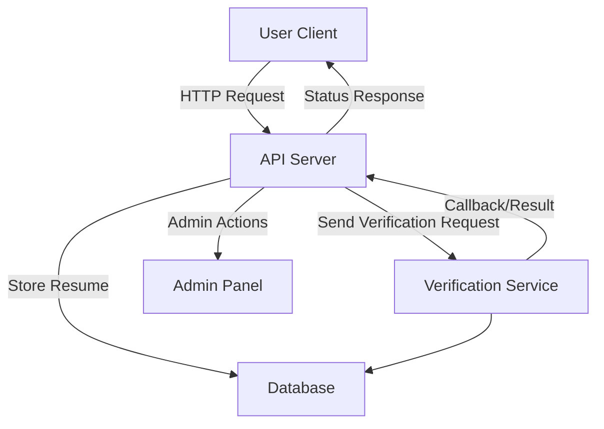

# Resume Authentication

Resume Authentication is a robust backend system designed to authenticate, verify, and manage resumes and credentials efficiently. It leverages modern web technologies to ensure that submitted resumes are genuine, streamlining the verification process for employers, recruiters, and job seekers. This project provides secure APIs for document upload, verification requests, and status tracking, enabling seamless integration with HR platforms and job portals.

---

## Features

- Secure user authentication and authorization workflows
- Resume upload and digital storage with validation
- Automated and manual resume verification processes
- Status tracking for verification requests
- RESTful API endpoints for integration
- Modular, extensible architecture for custom workflows
- Role-based access control for admin and users
- Comprehensive error handling and validation
- Detailed logging and audit trails
- Scalable design for deployment in production environments

---

## Requirements

Ensure you have the following prerequisites installed:

- Node.js (version 14.x or above)
- npm or yarn package manager
- MongoDB (or another supported database, depending on configuration)
- Git (for cloning the repository)
- Optional: Docker (for containerized deployment)

---

## Installation

Follow these steps to set up the project locally:

1. **Clone the repository:**
   ```bash
   git clone https://github.com/PRIT-G/resume-authentication.git
   cd resume-authentication
   ```

2. **Install dependencies:**
   ```bash
   npm install
   # or
   yarn install
   ```

3. **Configure environment variables:**
   - Copy the example environment file and update values as needed:
     ```bash
     cp .env.example .env
     ```
   - Set database URI, authentication secrets, and other settings in `.env`.

4. **Run database migrations (if applicable):**
   ```bash
   npm run migrate
   ```

5. **Start the server:**
   ```bash
   npm run dev
   # or
   yarn dev
   ```

---

## Usage

Once installed, you can interact with the backend API using HTTP clients or by integrating it with your application.

### Typical Workflow

1. **User Registration & Login:**  
   Users register and log in to receive authentication tokens.

2. **Resume Upload:**  
   Authenticated users upload their resume documents via API.

3. **Verification Request:**  
   Users or admins trigger a verification process for uploaded resumes.

4. **Status Tracking:**  
   Endpoints provide status updates throughout the verification lifecycle.

5. **Admin Actions:**  
   Admins can review, approve, or reject verification requests and manage users.

### Example API Usage

- Register a new user
- Log in and obtain a JWT token
- Upload a resume (multipart/form-data)
- Request verification for a resume
- Check verification status via GET endpoint

### API Architecture Overview



---

### Example Endpoints

#### User Registration (POST /register)

```api
{
    "title": "User Registration",
    "description": "Register a new user account.",
    "method": "POST",
    "baseUrl": "https://api.example.com",
    "endpoint": "/register",
    "headers": [
        {
            "key": "Content-Type",
            "value": "application/json",
            "required": true
        }
    ],
    "bodyType": "json",
    "requestBody": "{\n  \"email\": \"user@example.com\",\n  \"password\": \"securePass123\"\n}",
    "responses": {
        "201": {
            "description": "User created",
            "body": "{\n  \"message\": \"Registration successful\"\n}"
        },
        "400": {
            "description": "Validation error",
            "body": "{\n  \"error\": \"Email already exists\"\n}"
        }
    }
}
```

#### User Login (POST /login)

```api
{
    "title": "User Login",
    "description": "Authenticate user and return a JWT token.",
    "method": "POST",
    "baseUrl": "https://api.example.com",
    "endpoint": "/login",
    "headers": [
        {
            "key": "Content-Type",
            "value": "application/json",
            "required": true
        }
    ],
    "bodyType": "json",
    "requestBody": "{\n  \"email\": \"user@example.com\",\n  \"password\": \"securePass123\"\n}",
    "responses": {
        "200": {
            "description": "Login successful",
            "body": "{\n  \"token\": \"jwt.token.here\"\n}"
        },
        "401": {
            "description": "Invalid credentials",
            "body": "{\n  \"error\": \"Invalid email or password\"\n}"
        }
    }
}
```

#### Resume Upload (POST /resumes/upload)

```api
{
    "title": "Resume Upload",
    "description": "Upload a resume PDF file for verification.",
    "method": "POST",
    "baseUrl": "https://api.example.com",
    "endpoint": "/resumes/upload",
    "headers": [
        {
            "key": "Authorization",
            "value": "Bearer <token>",
            "required": true
        },
        {
            "key": "Content-Type",
            "value": "multipart/form-data",
            "required": true
        }
    ],
    "bodyType": "form",
    "formData": [
        {
            "key": "file",
            "value": "PDF resume file",
            "required": true
        }
    ],
    "responses": {
        "201": {
            "description": "Resume uploaded",
            "body": "{\n  \"resumeId\": \"abc123\",\n  \"message\": \"Resume uploaded successfully\"\n}"
        },
        "400": {
            "description": "File missing or invalid",
            "body": "{\n  \"error\": \"No file uploaded\"\n}"
        }
    }
}
```

#### Request Resume Verification (POST /resumes/{id}/verify)

```api
{
    "title": "Request Resume Verification",
    "description": "Initiate verification for a specific uploaded resume.",
    "method": "POST",
    "baseUrl": "https://api.example.com",
    "endpoint": "/resumes/{id}/verify",
    "headers": [
        {
            "key": "Authorization",
            "value": "Bearer <token>",
            "required": true
        }
    ],
    "pathParams": [
        {
            "key": "id",
            "value": "Resume ID",
            "required": true
        }
    ],
    "bodyType": "none",
    "responses": {
        "202": {
            "description": "Verification started",
            "body": "{\n  \"message\": \"Verification initiated\"\n}"
        },
        "404": {
            "description": "Resume not found",
            "body": "{\n  \"error\": \"Resume does not exist\"\n}"
        }
    }
}
```

#### Get Verification Status (GET /resumes/{id}/status)

```api
{
    "title": "Get Verification Status",
    "description": "Retrieve the current verification status of a resume.",
    "method": "GET",
    "baseUrl": "https://api.example.com",
    "endpoint": "/resumes/{id}/status",
    "headers": [
        {
            "key": "Authorization",
            "value": "Bearer <token>",
            "required": true
        }
    ],
    "pathParams": [
        {
            "key": "id",
            "value": "Resume ID",
            "required": true
        }
    ],
    "bodyType": "none",
    "responses": {
        "200": {
            "description": "Status retrieved",
            "body": "{\n  \"status\": \"pending\",\n  \"details\": \"Verification in progress\"\n}"
        },
        "404": {
            "description": "Resume not found",
            "body": "{\n  \"error\": \"Resume does not exist\"\n}"
        }
    }
}
```

---

## Contributing

Contributions are welcome! To contribute:

- Fork the repository and create a new branch for your feature or bugfix.
- Write clear, concise commit messages.
- Ensure code style and documentation match project conventions.
- Add appropriate tests for new or changed functionality.
- Submit a pull request with a detailed summary of your changes.

Before contributing, please review the CODE_OF_CONDUCT.md and CONTRIBUTING.md files if available.

---

## License

This project is licensed under the MIT License.

```text
MIT License

Copyright (c) 2024 PRIT-G and rudragohil2006

Permission is hereby granted, free of charge, to any person obtaining a copy
of this software and associated documentation files (the "Software"), to deal
in the Software without restriction, including without limitation the rights
to use, copy, modify, merge, publish, distribute, sublicense, and/or sell
copies of the Software, and to permit persons to whom the Software is
furnished to do so, subject to the following conditions:

The above copyright notice and this permission notice shall be included in all
copies or substantial portions of the Software.

THE SOFTWARE IS PROVIDED "AS IS", WITHOUT WARRANTY OF ANY KIND, EXPRESS OR
IMPLIED, INCLUDING BUT NOT LIMITED TO THE WARRANTIES OF MERCHANTABILITY,
FITNESS FOR A PARTICULAR PURPOSE AND NONINFRINGEMENT. IN NO EVENT SHALL THE
AUTHORS OR COPYRIGHT HOLDERS BE LIABLE FOR ANY CLAIM, DAMAGES OR OTHER
LIABILITY, WHETHER IN AN ACTION OF CONTRACT, TORT OR OTHERWISE, ARISING FROM,
OUT OF OR IN CONNECTION WITH THE SOFTWARE OR THE USE OR OTHER DEALINGS IN THE
SOFTWARE.
```

---

For further questions or support, please open an issue or contact the repository maintainers.
